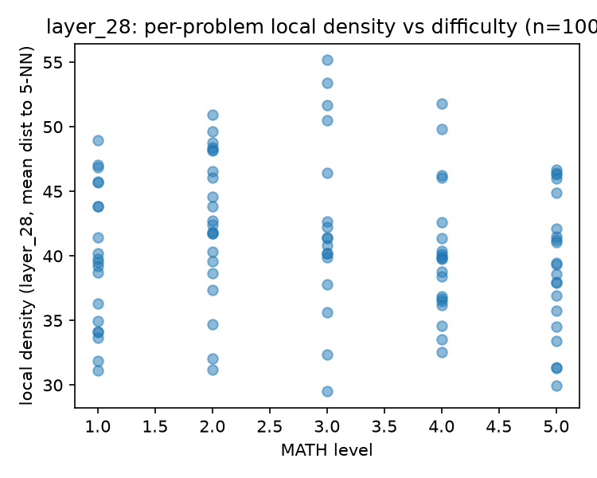
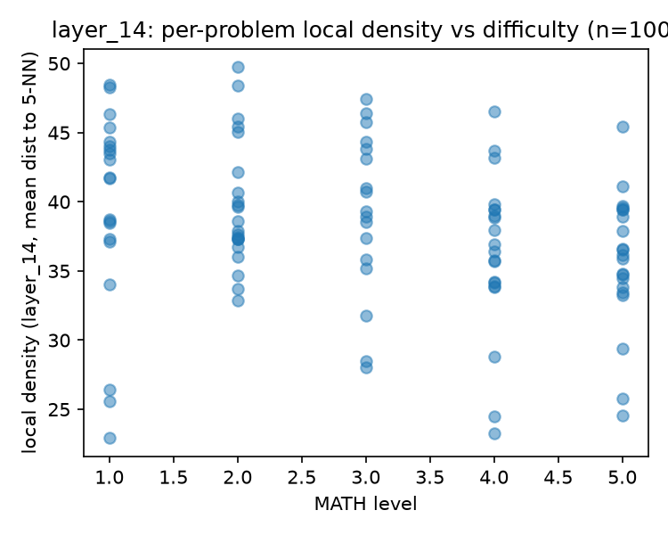
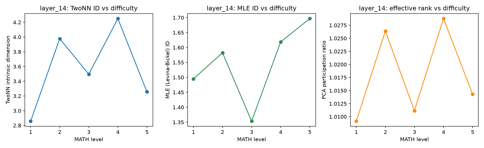
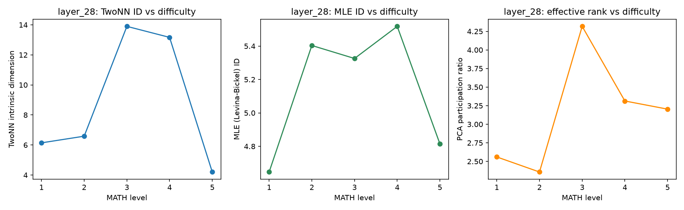

# Pilot Results: Activation Geometry & Problem Difficulty (Direction C)

**Status:** Completed `activations_only` pilot on a 100-problem subset of the MATH benchmark (levels 1-5) using `Qwen2.5-1.5B-Instruct`. Analyzed Intrinsic Dimension (TwoNN, MLE, PCA) and per-problem local density across confirmatory (layer 28) and exploratory (layer 14) layers.

## 1. Local Density vs. Difficulty (Key Finding)

* **Layer 28 (Last Layer):** No statistically significant correlation between local density and problem difficulty (Spearman = -0.113, p=0.262).

* **Layer 14 (Middle Layer):** A statistically significant negative correlation was found between mean distance to nearest neighbors and MATH difficulty level (Spearman = -0.298, p=0.003). 

**What this means for future work:** This is a strong physical validation of FrugalProver's core hypothesis (H1). It demonstrates that the model clusters complex problems into a denser, specific manifold midway through its forward pass. The budget oracle should prioritize features extracted from middle layers, as the geometric signal of "difficulty" is present there before being lost or transformed in the final output layers.

## 2. Intrinsic Dimension Estimators (TwoNN, MLE, PCA)

* **Result:** While the non-linear estimators (TwoNN and MLE) agree on the directional trend at layer 14, the aggregated ID curves across all levels remain highly noisy and unstable. 
* **Cause:** ID estimators are highly sensitive to sample size. The current pilot scale (~20 problems per difficulty level) is insufficient to produce smooth manifolds.

**What this means for future work:** We cannot make definitive claims about absolute dimensionality shifts at this scale. Full investigation of the ID estimators requires larger computational resources to process the entire dataset. This specific sub-task is deferred to the start of the school program, once full compute quotas are allocated.

## Next Steps (Blocked by Compute)
* Merge current geometry metrics with `full_sweep` outcomes (budget success/failure labels) to test the correlation between local density and actual solvability (the second half of Direction C).